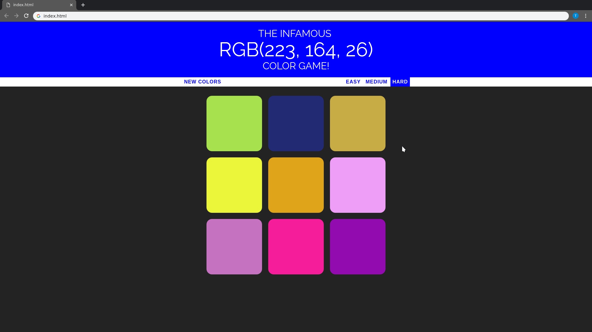

# color-game
Color game written in JS, HTML, and CSS demonstrating the following fundamental concepts:

- Responsive web design
- Clean and refactored code
- Modular structuring
- DOM manipulation

Objective of the game is to guess the given RGB value displayed in the header.

Game was refactored for functionality and additional difficulty levels were added.
